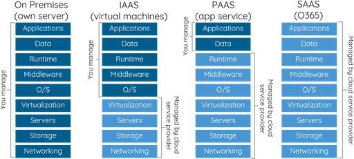
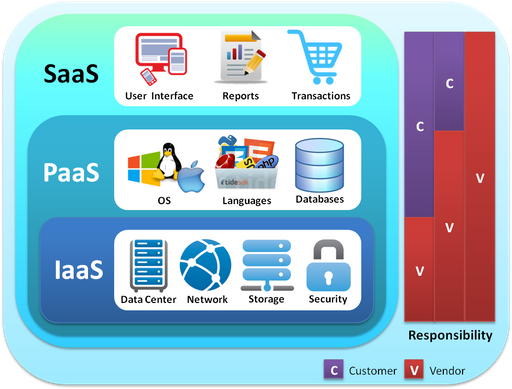

Hey Folks!

In this blog post, I’ll share some of my thoughts about what STEAM is all about and a concise summary of applications I think are worthwhile to consider. I’m sure you’re aware that STEAM covers a significant amount of career fields and activities, so we can focus on a more specific approach that would be good to inform a beginner.

The famous NASA physicist & mathematician, Katherine Johnson, provided a great summarizing quote of these principles in my opinion.

Who knows where greatness can emerge? We need to be honest about how the past influenced our current state of affairs.

This is barely touching on what can be said about this topic. Feel free to share any thoughts, or things I’ve missed or been unclear about.

All the best!

\- Chaance

<!--EndFragment-->